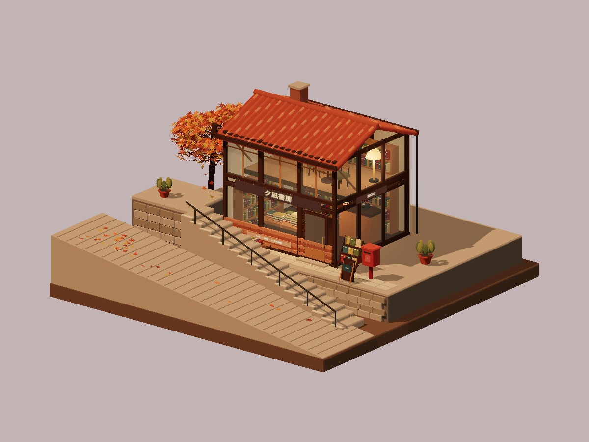
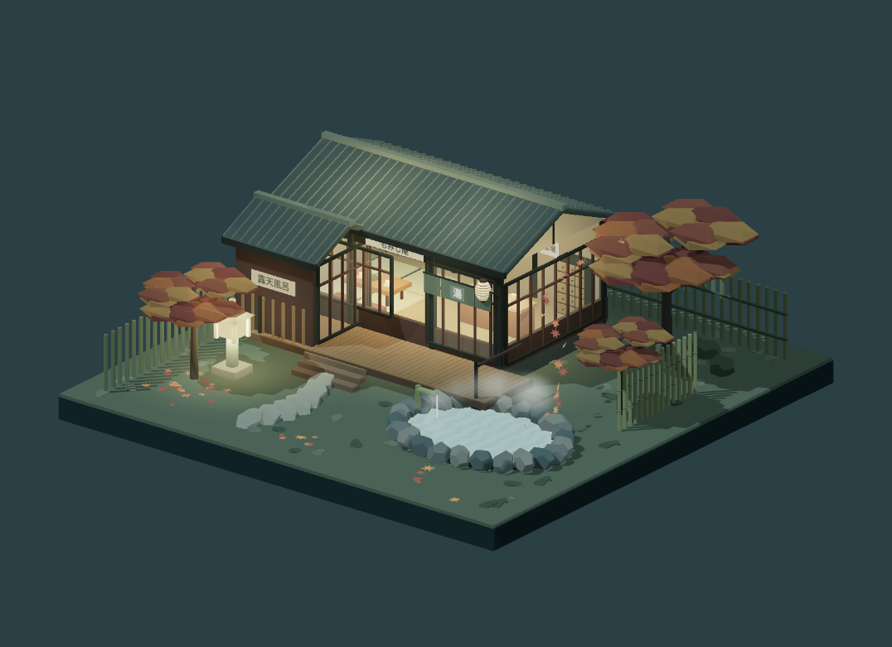
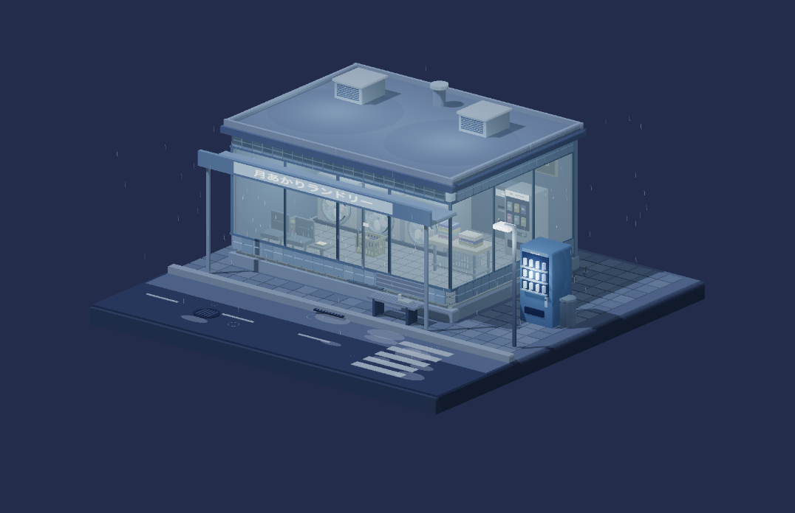
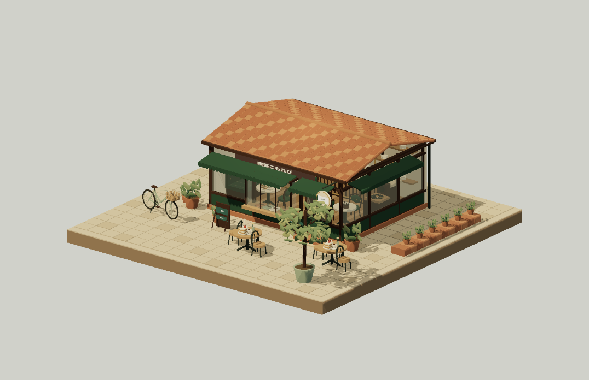

# Japanese Miniature Scenes

**Nine quiet corners. One repository. Nine independent little worlds.**

A collection of interactive, Japanese-inspired 3D dioramas built with **Three.js, TypeScript, and Vite**. Each scene is a real, freely orbitable miniature: a complete square base, carefully arranged architecture, small everyday objects, and its own weather and lighting.

There are no characters, HUDs, accounts, or backend services. Opening a scene goes straight to the model, with no menu or scene-selection screen.

> This README is the visual overview, not a website landing page. The applications remain separate, and no central gallery is included in the web builds.

## Scene previews

These are captures of the actual rendered models, not concept images. Click a preview to open that scene's source and instructions.

| **Seaside Station** | **Hillside Bookshop** | **Rainy Florist** |
| :---: | :---: | :---: |
| [](scenes/seaside-station/) | [](scenes/hillside-bookshop/) | [](scenes/rainy-florist/) |
| Summer light, sea breeze, and an empty platform. | Old books, stone steps, and the last light of day. | Hydrangeas waiting beneath a rain shelter. |

| **Mountain Onsen** | **Midnight Laundromat** | **Morning Fish Market** |
| :---: | :---: | :---: |
| [](scenes/mountain-onsen/) | [](scenes/midnight-laundromat/) | [](scenes/morning-fish-market/) |
| Warm windows, fallen leaves, and rising steam. | Quiet rain while the last wash keeps turning. | A small harbor waking up beside the water. |

| **Afternoon Kissaten** | **Rainy Konbini** | **Snowy Ramen Shop** |
| :---: | :---: | :---: |
| [](scenes/afternoon-kissaten/) | [](scenes/rainy-konbini/) | [](scenes/snowy-ramen/) |
| Coffee, pastries, and a slow afternoon. | A little island of warm light on a rainy night. | Snow at the eaves and a hot bowl inside. |

## What is inside

- **Real geometry, not image parallax.** Buildings, furniture, products, plants, and street details are modeled in code and can be viewed from different angles.
- **Nine distinct settings.** Daylight, sunset, rain, snow, sea air, and autumn evenings shape the atmosphere.
- **Small ambient animations.** Waves, rain, snow, steam, falling leaves, and rotating laundry appear where appropriate.
- **Mouse, touch, and keyboard controls.** Orbit, pan, zoom, and reset the camera without an on-screen toolbar.
- **Reduced-motion support.** Ambient movement is disabled or held at a static state while the model remains interactive.
- **Static hosting only.** No API keys, accounts, databases, remote asset service, or server runtime is required after building.
- **Independent scene code.** Every scene owns its geometry, viewer, configuration, and assets. There are no runtime imports between scene projects.

### The nine projects

| Project | Setting | Details to look for |
| --- | --- | --- |
| [`seaside-station`](scenes/seaside-station/) | A sunny coastal stop | Platform benches, ticket counter, timetable, crossing barriers, waves, and a wind chime |
| [`hillside-bookshop`](scenes/hillside-bookshop/) | An autumn hillside at sunset | Terraced stonework, stacked books, an upstairs reading room, maple foliage, and scattered leaves |
| [`rainy-florist`](scenes/rainy-florist/) | A flower shop during the rainy season | Hydrangea florets, bouquets, wrapping supplies, a translucent awning, tram rails, and a rain chain |
| [`mountain-onsen`](scenes/mountain-onsen/) | A mountain inn on an autumn night | A tatami lounge, tea table, bamboo fencing, stone lantern, outdoor bath, steam, and fallen leaves |
| [`midnight-laundromat`](scenes/midnight-laundromat/) | A quiet late-night laundry | Six round-front machines, moving laundry, folding tables, baskets, detergent, and waiting seats |
| [`morning-fish-market`](scenes/morning-fish-market/) | A small harbor in the morning | Fish on crushed ice, market crates, scales, a timber pier, ropes, and a gently rocking boat |
| [`afternoon-kissaten`](scenes/afternoon-kissaten/) | A neighborhood coffee shop | Siphon coffee equipment, cakes, cups, upholstered seating, records, patio tables, and a bicycle |
| [`rainy-konbini`](scenes/rainy-konbini/) | A convenience-store street corner | Stocked shelves, chilled cabinets, checkout, vending machine, umbrellas, rain, and wet reflections |
| [`snowy-ramen`](scenes/snowy-ramen/) | A warm ramen shop on a snowy night | Ramen bowls, soup pots, stools, paper lanterns, snowy eaves, a parked bicycle, and drifting snow |

## Quick start

### Requirements

- **Node.js 22.18 or newer**; Node 22 LTS is specified in [`.nvmrc`](.nvmrc).
- npm, included with Node.js.
- A modern browser with **WebGL 2** and hardware acceleration enabled.

```bash
git clone https://github.com/xiaoninemao/japanese-miniature-scenes.git
cd japanese-miniature-scenes
npm ci

# Start one scene, not a gallery.
npm run dev --workspace=seaside-station
```

Open the local URL printed by Vite. To explore another project, stop that process and run the same command with a different workspace name from the table above:

```bash
npm run dev --workspace=hillside-bookshop
npm run dev --workspace=snowy-ramen
```

Do not double-click the source HTML file. Use the development server or serve the production build over HTTP.

## Controls

| Input | Action |
| --- | --- |
| Left mouse drag | Orbit around the miniature |
| Right mouse drag | Pan the view |
| Mouse wheel | Zoom |
| One-finger drag | Orbit on a touchscreen |
| Two-finger drag / pinch | Pan / zoom on a touchscreen |
| Arrow keys | Orbit while the canvas is focused |
| `+` / `-` | Zoom while the canvas is focused |
| `Home` | Restore the initial camera |

Camera movement never starts automatically. Normal scene views contain only the model; an error message is shown if rendering cannot start.

## Build and test

Run these commands from the repository root:

```bash
# Test geometry, bounds, and scene-specific structural fixes.
npm test

# Type-check every scene.
npm run typecheck

# Build all nine projects.
npm run build

# Or build and preview a single project.
npm run build --workspace=morning-fish-market
npm run preview --workspace=morning-fish-market
```

Each production app is written to `scenes/<project>/dist/`. These files can be served by any static web host.

The regression tests include model construction and batching, square-base bounds, leaf contact with flat and sloping ground, the fish market's roof-to-wall connections, and the station benches' supports and clearances. Browser rendering still matters when changing materials, camera framing, or lighting.

## Static deployment

### Deploy one scene

Build the selected workspace, then upload **the contents of its `dist/` directory** to a static host. Every app uses relative asset paths, so it works at a domain root or under a repository subdirectory.

### Prepare all nine for GitHub Pages

```bash
npm run build:pages
```

This creates:

```text
site/
├── .nojekyll
├── seaside-station/index.html
├── hillside-bookshop/index.html
├── rainy-florist/index.html
├── mountain-onsen/index.html
├── midnight-laundromat/index.html
├── morning-fish-market/index.html
├── afternoon-kissaten/index.html
├── rainy-konbini/index.html
└── snowy-ramen/index.html
```

The output intentionally has **no root `index.html`**. Each scene has its own direct URL; there is no combined landing page.

Automatic publishing is not enabled in this repository. To publish manually, one option is the optional [`gh-pages`](https://www.npmjs.com/package/gh-pages) command-line tool:

```bash
# Run only when you want to publish. This pushes built files to a gh-pages branch.
npx gh-pages --dist site --dotfiles
```

Then select **Settings → Pages → Build and deployment → Deploy from a branch**, choose `gh-pages`, and use its root directory.

After publication, a scene URL follows this pattern:

```text
https://xiaoninemao.github.io/japanese-miniature-scenes/seaside-station/
```

Use the corresponding project name for each of the other eight scenes. The repository's Pages root is intentionally not a scene picker.

## Repository layout

```text
.
├── README.md
├── package.json                  # npm workspace commands
├── package-lock.json             # one dependency lock for the repository
├── scripts/
│   └── assemble-pages.mjs        # collects static builds; creates no landing page
└── scenes/
    └── <project>/
        ├── README.md
        ├── index.html           # opens this model directly
        ├── package.json
        ├── public/
        │   ├── favicon.svg
        │   └── preview.png
        ├── src/
        │   ├── main.ts          # starts this model
        │   ├── model.ts         # geometry and ambient animation
        │   ├── config.ts        # lighting, background, and initial camera
        │   ├── kit.ts           # geometry/material helpers and static batching
        │   ├── viewer.ts        # renderer, input, resize, and cleanup
        │   └── ...
        └── tests/
```

The convenience store and ramen shop split their larger models into additional store, street, weather, and reflection modules. Those modules remain inside their own project.

## Making changes

1. Open the scene's `src/model.ts` to edit its geometry. Larger scenes may delegate to local modules.
2. Use `src/config.ts` for lighting, background color, and the initial viewpoint.
3. Keep geometry within the square base, spanning **−7.5 to 7.5 on the X and Z axes**.
4. Mark animated meshes or their parent groups with `userData.dynamic = true` so static batching does not remove their independent transforms.
5. Respect the reduced-motion argument in animation updates.
6. Run that workspace's tests and build, inspect the result in a browser, and refresh `public/preview.png` if its appearance changes.

Textures and Japanese signs are drawn in the browser from code. The previews are documentation assets; they are not used as substitutes for the 3D models.
