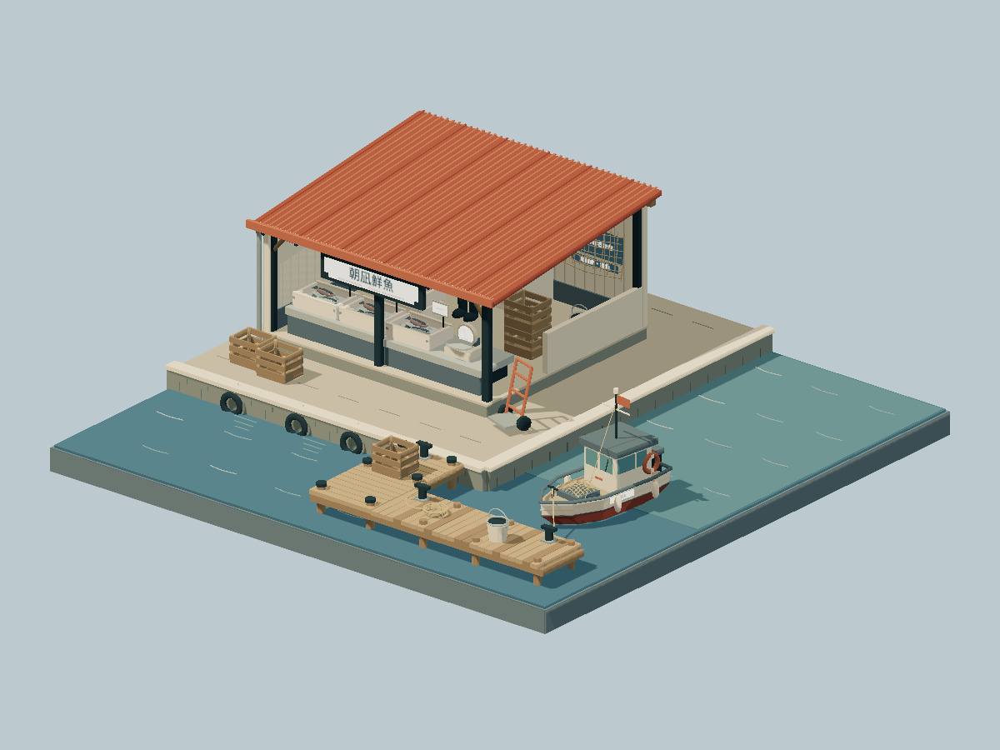

# Morning Fish Market

A small fish stall above a working harbor. Fish rest on modeled ice beside scales and crates; a timber pier, ropes, bollards, and a gently rocking fishing boat extend the scene over the water.



## Run

From the repository root, using Node.js 22.18 or newer:

```bash
npm ci
npm run dev --workspace=morning-fish-market
npm test --workspace=morning-fish-market
npm run build --workspace=morning-fish-market
npm run preview --workspace=morning-fish-market
```

There is no scene selector or in-scene UI. Drag to orbit, right-drag to pan, and use the wheel to zoom. Touch supports one-finger orbit and two-finger pan/pinch. With the canvas focused, arrow keys orbit, `+`/`-` zoom, and `Home` restores the view.

Edit `src/model.ts` for the stall, boat, and waves, or `src/config.ts` for lighting. Structural tests verify that the rear wall, sloping side wall, and roof posts meet the pitched roof while the front counter remains open.

The production output is this scene's `dist/` directory. It works on static hosts using relative assets. Reduced-motion preferences are respected.
