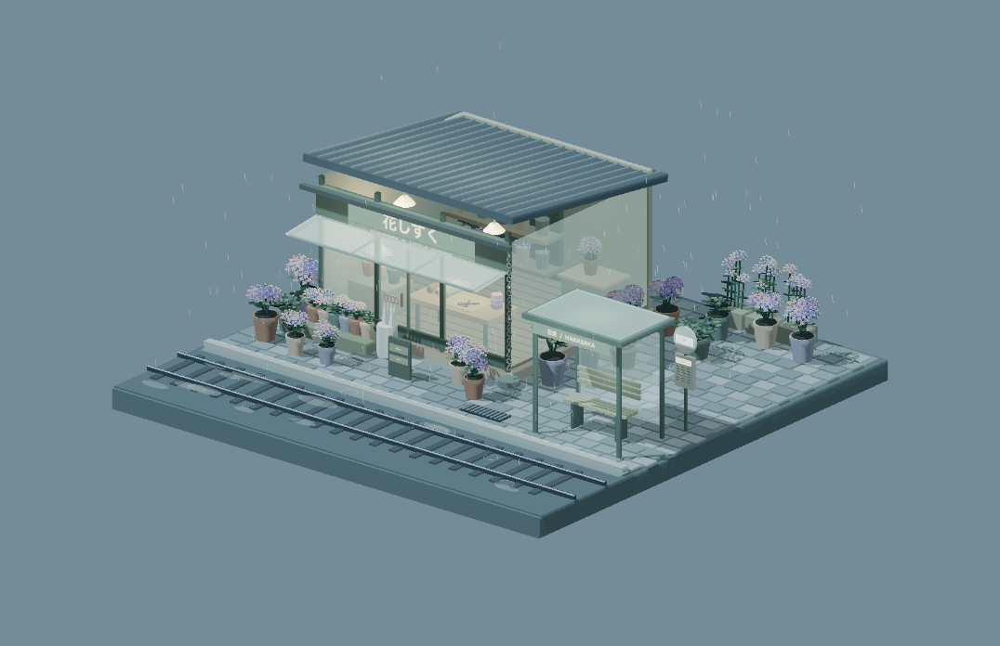

# Rainy Florist

A hydrangea-filled flower shop beside a small tram stop. The miniature includes modeled florets, bouquets, wrapping supplies, a translucent canopy, umbrellas, rails, and a dripping rain chain.



## Run

From the repository root, using Node.js 22.18 or newer:

```bash
npm ci
npm run dev --workspace=rainy-florist
npm test --workspace=rainy-florist
npm run build --workspace=rainy-florist
npm run preview --workspace=rainy-florist
```

The page contains only the model. Drag to orbit, right-drag to pan, and use the wheel to zoom. Touch supports single-finger orbit and two-finger pan/pinch. Arrow keys, `+`/`-`, and `Home` are available with the canvas focused.

Geometry and rain updates live in `src/model.ts`; lighting and initial framing live in `src/config.ts`. Reduced-motion mode suppresses the weather animation.

Upload this project's built `dist/` contents to any static host. No backend, account, API key, or runtime import from another scene is required.
