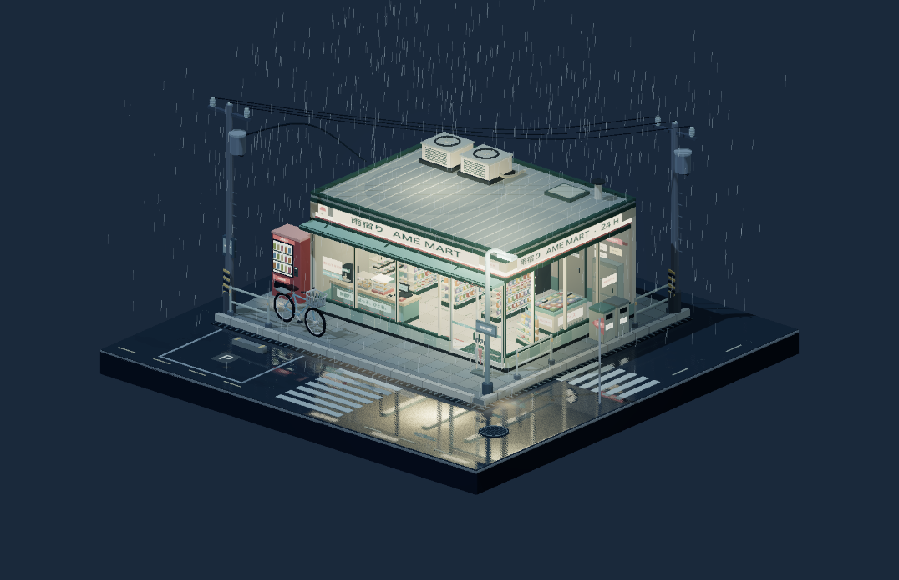

# Rainy Konbini

A brightly stocked convenience store at a wet street corner. Large windows reveal shelves, chilled cabinets, checkout, and food displays; outside are a vending machine, bicycle, umbrellas, utility wires, rain, and pavement reflections.



## Run

From the repository root, using Node.js 22.18 or newer:

```bash
npm ci
npm run dev --workspace=rainy-konbini
npm test --workspace=rainy-konbini
npm run build --workspace=rainy-konbini
npm run preview --workspace=rainy-konbini
```

The page opens directly into the model. Mouse drag orbits, right-drag pans, and the wheel zooms. Touch supports single-finger orbit and two-finger pan/pinch. Focus the canvas for arrow keys, `+`/`-`, and `Home`.

## Source map

- `src/model.ts` combines this scene's local modules.
- `src/store.ts` builds the shop and stocked interior.
- `src/street.ts` builds the square base and exterior objects.
- `src/weather.ts` controls rain and ripples.
- `src/reflection.ts` provides the orthographic wet-ground reflection.
- `src/config.ts` sets the lights and initial camera.

Reduced-motion mode disables the rain and ripple motion. The built `dist/` directory is a self-contained static app; it does not load another scene or require a server.
