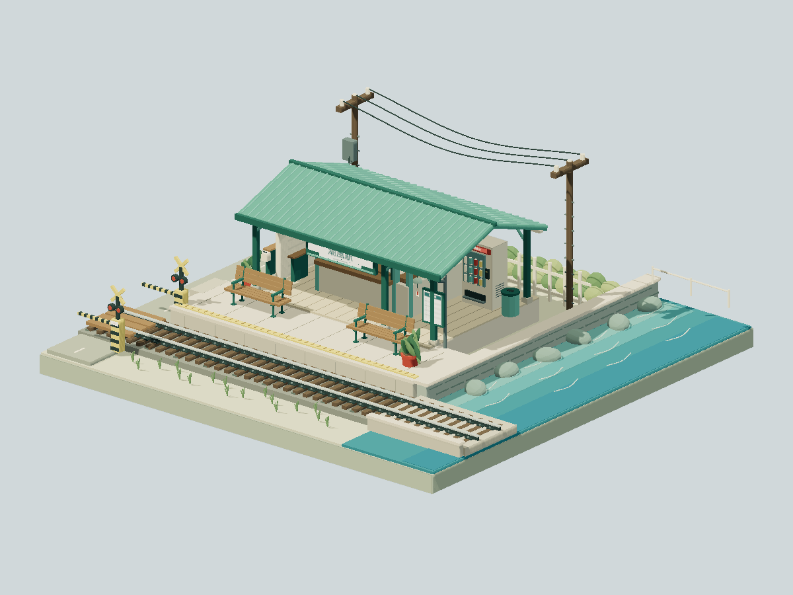

# Seaside Station

A quiet summer stop beside turquoise water, with a mint-roofed shelter, ticket counter, timetable, crossing barriers, and two platform benches. Waves and a small wind chime provide subtle movement.



## Run

From the repository root, using Node.js 22.18 or newer:

```bash
npm ci
npm run dev --workspace=seaside-station
npm test --workspace=seaside-station
npm run build --workspace=seaside-station
npm run preview --workspace=seaside-station
```

The app opens directly into this model. Drag to orbit, right-drag to pan, and use the wheel to zoom. Touch supports one-finger orbit and two-finger pan/pinch. With the canvas focused, arrow keys orbit, `+`/`-` zoom, and `Home` resets the camera.

Edit `src/model.ts` for geometry and animation, or `src/config.ts` for lighting and camera framing. Tests check model bounds and the benches' platform contact, supports, and clearance from the shelter columns.

The production output is this project's `dist/` folder. It uses relative assets and needs only static hosting. No other scene's source or assets are imported at runtime.
