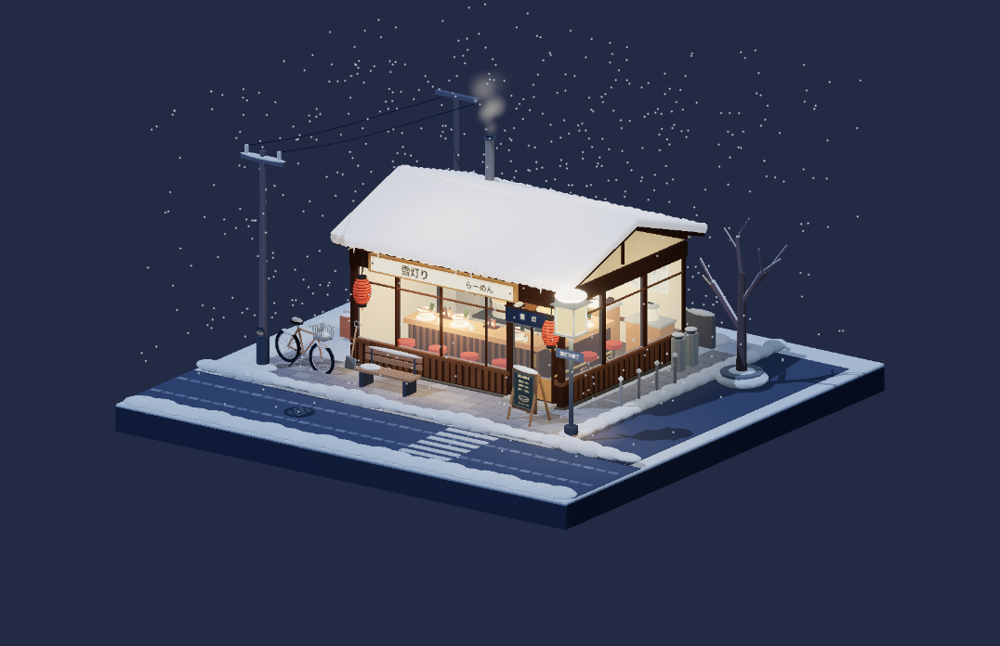

# Snowy Ramen Shop

A small timber ramen shop glowing beneath a snowy roof. Look inside for the counter, red stools, ramen bowls, condiments, soup pots, and kitchen equipment; outside are lanterns, a menu board, a bench, a bicycle, and a cleared path.



## Run

From the repository root, using Node.js 22.18 or newer:

```bash
npm ci
npm run dev --workspace=snowy-ramen
npm test --workspace=snowy-ramen
npm run build --workspace=snowy-ramen
npm run preview --workspace=snowy-ramen
```

The page contains the model, not a scene-selection interface. Mouse drag orbits, right-drag pans, and the wheel zooms. Touch supports one-finger orbit and two-finger pan/pinch. Arrow keys, `+`/`-`, and `Home` work when the canvas is focused.

## Source map

- `src/model.ts` combines the local shop, street, and weather modules.
- `src/store.ts` builds the restaurant and kitchen.
- `src/street.ts` builds the snowy square base and exterior details.
- `src/weather.ts` controls snowfall, soup steam, and chimney smoke.
- `src/config.ts` sets the lighting and initial camera.

Reduced-motion mode hides snowfall and holds the steam still. This scene builds to its own static `dist/` directory, with no backend or cross-scene imports.
